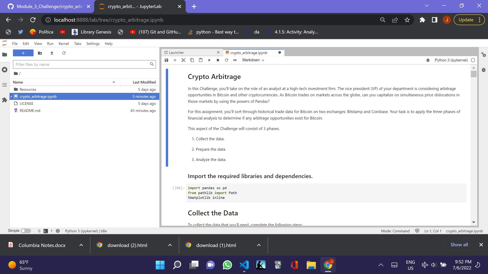
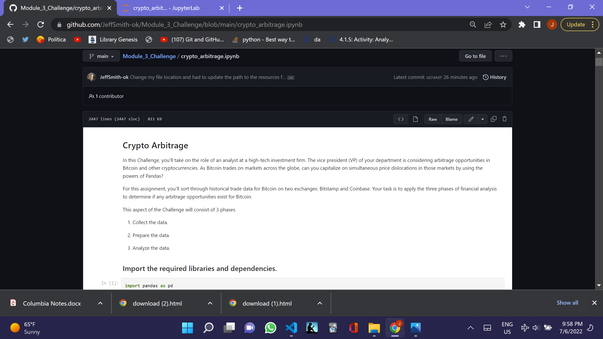

# Crypto Arbitrage

You can read this and/or you can open the crypto_arbitrage.ipynb and this will all be explained to you there.

I am considering arbitrage opportunities in the Bitcoin and other cyptocurrencies. Due to the fact that bitcoin trades on markets across the globe, we may be able to capitalize on simultaneous price dislocations through the power of Pandas.

I will sort through historical data for Bitcoin on two exchanges: Bitstamp and Coinbase. In this project, I will apply the three phases of financial analysis to determine if any arbitrage opportunties exist.

The three phases of the financial analysis are:

1. Collect the data.

2. Prepare the data.

3. Analyze the data.

In order to explain what will happen, please note the following:

With respect to collecting the data, I will read in the data with the 'read csv' function and the 'Path' module, and create two dataframes with respect to 'bitstamp' and 'coinbase'.

Secondly, regarding preparing the data, I will go through the two dataframes and I will drop all 'NaN' or missing values in the data frame. I will use 'str.replace' function to remove the dollar signs ($) from the Close columns. Finally, I will convert the data type of the close column to 'float' from the 'string' value. I will review the duplicated values and drop them, if necessary.

Thirdly, I will analyze the data, which will focus on the closing price, and I will provide the summary statistics on specific dates and also a number of plots, such as overlay and boxplot , and I will calculate the arbitrage profits.

## Technologies

This was developed with Anaconda, which includes Pandas, Matplotlib and Jupyter Notebook and I created it in a development environment running Python 3.7.13.

---

## Installation Guide

To install the programs to run the program, you have to do the following or you can open 'crypto_arbitrage.ipynb' in github and read the file there.

Install Anaconda and Python. </br>

Git clone the repo and run it, pursuant to the following clone address

git clone https://github.com/JeffSmith-ok/Module_3_Challenge.git

cd Module_3_challenge

In the terminal type 'Jupyter Lab'

---

## Usage

The following images show the notebook read in Juypter Lab and in Github under crypto_arbitrage.ipynb.

## 

## 

---

## Contributors

This is the third of the individual learning challenges.

My contact information is:

Name: Jeffrey M. Smith </br>
Linkedin: https://www.linkedin.com/in/jeffsmith77/ </br>
Personal email: jsmith@lexsmith.finance </br>
Phone: 332 238 5209

---

## License

MIT License

Copyright (c) 2022 Jeffrey M. Smith

Permission is hereby granted, free of charge, to any person obtaining a copy of this software and associated documentation files (the "Software"), to deal in the Software without restriction, including without limitation the rights to use, copy, modify, merge, publish, distribute, sublicense, and/or sell
copies of the Software, and to permit persons to whom the Software is furnished to do so, subject to the following conditions:

The above copyright notice and this permission notice shall be included in all copies or substantial portions of the Software.

THE SOFTWARE IS PROVIDED "AS IS", WITHOUT WARRANTY OF ANY KIND, EXPRESS OR IMPLIED, INCLUDING BUT NOT LIMITED TO THE WARRANTIES OF MERCHANTABILITY, FITNESS FOR A PARTICULAR PURPOSE AND NONINFRINGEMENT. IN NO EVENT SHALL THE AUTHORS OR COPYRIGHT HOLDERS BE LIABLE FOR ANY CLAIM, DAMAGES OR OTHER LIABILITY, WHETHER IN AN ACTION OF CONTRACT, TORT OR OTHERWISE, ARISING FROM, OUT OF OR IN CONNECTION WITH THE SOFTWARE OR THE USE OR OTHER DEALINGS IN THE
SOFTWARE.

```

```
